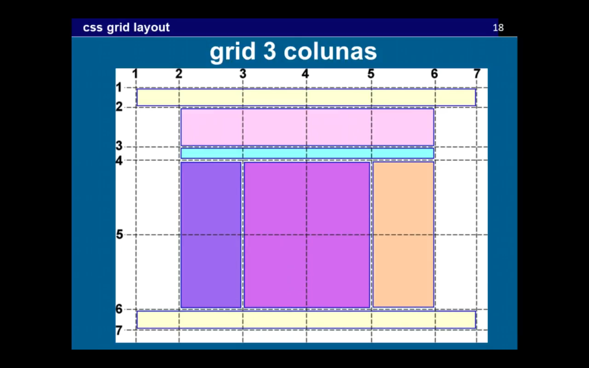

# Grid Layout / [Maujor's lecture](https://www.youtube.com/watch?v=6hBFRwpXQko)

This is an example of css grid layout of the lecture.



## Html

```
<div class="container">
	<header>header</header>
	<figure>figure</figure>
	<nav>nav</nav>
	<main>main</main>
	<aside class="sidebar">sidebar</aside>
	<aside class="aux">aux</aside>
	<footer>footer</footer>
</div>
```

## More information

* [Awseome Grid Layout](https://github.com/simoneas02/awesome-grid-layout)
* [Developer Mozilla](https://developer.mozilla.org/pt-BR/docs/Web/CSS/CSS_Grid_Layout/Basic_Concepts_of_Grid_Layout)